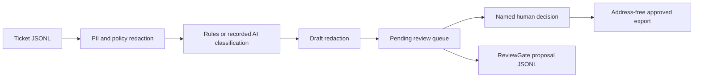

# DraftOps

[](https://github.com/kanuwrld/draftops/actions/workflows/ci.yml)
[](LICENSE)

Privacy-aware, draft-only support triage automation with explicit human review.

DraftOps reads support tickets, removes personal and policy-defined identifiers,
classifies intent and priority, prepares reply drafts, and writes review artifacts.
It contains no delivery connector and every output stays `pending` until a named
human records a decision.

The included rules classifier makes demos and tests deterministic. A separate
model runner can supply recorded AI predictions through a JSON file; DraftOps
validates those predictions and redacts generated drafts again before storing
them. This keeps model credentials and network calls outside the pipeline.

## Quick start

Requirements: Python 3.10+.

```bash
python -m pip install -e .

draftops process examples/tickets.jsonl \
  --policy examples/policy.json \
  --predictions examples/recorded-predictions.json \
  --out .tmp/demo-run
```

Generated artifacts:

```text
.tmp/demo-run/
├── RUN.md
├── privacy-report.json
├── queue.json
└── reviewgate-proposals.jsonl
```

The privacy report stores redaction labels and counts, never original values.
The queue contains sanitized ticket context and drafts. The JSONL proposals can
be submitted one by one to a compatible ReviewGate policy.

Run without `--predictions` to use deterministic classification:

```bash
draftops process examples/tickets.jsonl \
  --policy examples/policy.json \
  --out .tmp/rules-run
```

## Local review flow

Record a final human decision:

```bash
draftops decide .tmp/demo-run/queue.json DEMO-1042 \
  --approve \
  --actor reviewer@example.invalid \
  --note "Fictional demo reviewed" \
  --decisions .tmp/demo-run/decisions.jsonl
```

Export only approved drafts:

```bash
draftops export .tmp/demo-run/queue.json \
  --decisions .tmp/demo-run/decisions.jsonl \
  --out .tmp/demo-run/approved
```

Approved exports deliberately omit delivery addresses. A separate, authenticated
connector must map the internal ticket ID to a destination and should re-check
the approval before sending.

## Pipeline



## Input and recorded predictions

Ticket JSONL fields:

```json
{"id":"DEMO-1","subject":"Question","body":"Fictional text","customer_email":"person@example.invalid"}
```

Recorded predictions are keyed by ticket ID:

```json
{
  "DEMO-1": {
    "category": "product",
    "priority": "normal",
    "confidence": 0.86,
    "draft": "A specialist will review the fictional setup."
  }
}
```

The category must exist in the selected policy. Priority and confidence are
strictly validated. Drafts are always reprocessed by the redaction layer.

## Safety boundary

Regex redaction is best-effort. It cannot detect every personal identifier,
trade secret, or contextual disclosure. Minimize input, keep real runs outside
public repositories, review artifacts manually, and apply organization-specific
data-retention and access controls.

This project demonstrates engineering controls; it is not a compliance claim or
legal advice.

## Development

```bash
python scripts/public_safety.py
python -m unittest discover -s tests -v
python -m compileall -q src tests
```

The public-safety check scans every tracked file and the full Git history for
high-confidence credential patterns and forbidden secret-bearing filenames. It
reports rule names and locations without printing matched values.

## Roadmap

- [ ] Signed prediction import format
- [ ] IMAP/Zendesk adapters that retain draft-only behavior
- [ ] Policy-specific retention windows and deletion command
- [ ] Reviewer UI with side-by-side redaction evidence

## License

MIT. See [LICENSE](LICENSE).

If DraftOps is useful for building safer support automation, a star helps other
builders find it.
